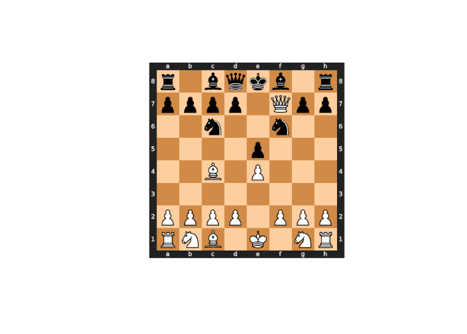

<!-- README.md is generated from README.Rmd. Please edit that file -->

# chess <a href='https://www.curso-r.com/'></a>

<!-- badges: start -->

[](https://github.com/curso-r/chess/actions)
[](https://CRAN.R-project.org/package=chess)
[](https://codecov.io/gh/curso-r/chess?branch=master)
[](https://www.tidyverse.org/lifecycle/#maturing)
<!-- badges: end -->

## Overview

`{chess}` is an *opinionated* wrapper for R around
[python-chess](https://github.com/niklasf/python-chess), an amazing
library created by [Niklas Fiekas](https://github.com/niklasf). It
allows users to read and write
[PGN](https://en.wikipedia.org/wiki/Portable_Game_Notation) files as
well as create and explore game trees such as the ones seen in chess
books.

## Installation

Install the released version of `{chess}` from CRAN:

``` r
install.packages("chess")
```

Or install the development version from GitHub with:

``` r
# install.packages("remotes")
remotes::install_github("curso-r/chess")
```

This should automatically install python-chess to your `{reticulate}`
environment, but you can also explicitly do it with a convenient
function:

``` r
chess::install_chess()
```

## Example

To read an existing game, simply use `read_game()`. To explore it you
can use `forward()`/`back()`, as well as `variations()`/`variation()` to
see all variations listed for the next move and choose one of them.

``` r
library(chess)

# Read final game from the Queen's Gambit
file <- system.file("harmon.pgn", package = "chess")
harmon_borgov <- read_game(file)

# Starting position
harmon_borgov
#>         <Start>
#> r n b q k b n r
#> p p p p p p p p
#> . . . . . . . .
#> . . . . . . . .
#> . . . . . . . .
#> . . . . . . . .
#> P P P P P P P P
#> R N B Q K B N R

# Navigate to 2. c4
harmon_borgov %>%
  forward(3)
#>         <2. c4>
#> r n b q k b n r
#> p p p . p p p p
#> . . . . . . . .
#> . . . p . . . .
#> . . P P . . . .
#> . . . . . . . .
#> P P . . P P P P
#> R N B Q K B N R

# See all variations for 2...
harmon_borgov %>%
  forward(3) %>%
  variations()
#>       <2... e5>          <2... e6>
#> r n b q k b n r    r n b q k b n r
#> p p p . . p p p    p p p . . p p p
#> . . . . . . . .    . . . . p . . .
#> . . . p p . . .    . . . p . . . .
#> . . P P . . . .    . . P P . . . .
#> . . . . . . . .    . . . . . . . .
#> P P . . P P P P    P P . . P P P P
#> R N B Q K B N R    R N B Q K B N R

# Follow the sideline
harmon_borgov %>%
  forward(3) %>%
  variation(2)
#>       <2... e6>
#> r n b q k b n r
#> p p p . . p p p
#> . . . . p . . .
#> . . . p . . . .
#> . . P P . . . .
#> . . . . . . . .
#> P P . . P P P P
#> R N B Q K B N R
```

Many other games are included with the package so you can get up and
running as soon as you install `{chess}`! See `vignette("games")` for
more information.

You can also create your own game with `game()` and add variations to
it: the `move()` function adds moves as well as branches the tree of the
game. Strings are converted to simple moves, while `list()`s behave
exactly as parenthesis in PGN, creating a variation of the last move.
Here you can see how to recreate a [Scholar’s
mate](https://en.wikipedia.org/wiki/Scholar%27s_mate) and some ways to
avoid it:

``` r
# Scholar's mate and some defenses
scholars_mate <- game() %>%
  move("e4") %>%
  move("e5", list("e6"), list("d5")) %>%
  move("Bc4") %>%
  move("Nc6", list("Nf6")) %>%
  move("Qh5") %>%
  move("Nf6", list("g6", "Qf3", "Nf6")) %>%
  move("Qxf7")

# Last mainline move
scholars_mate
#>      <4. Qxf7#>
#> r . b q k b . r
#> p p p p . Q p p
#> . . n . . n . .
#> . . . . p . . .
#> . . B . P . . .
#> . . . . . . . .
#> P P P P . P P P
#> R N B . K . N R
```

Note that there are many ways to structure the input to `move()`. See
`vignette("chess")` for more information.

`{chess}` also features many ways of seeing both the game as a whole and
the board at a specific point in time.

``` r
# Print with unicode (doesn't look good on GitHub)
print(scholars_mate, unicode = TRUE)
#>      <4. Qxf7#>
#> ♜ . ♝ ♛ ♚ ♝ . ♜
#> ♟ ♟ ♟ ♟ . ♕ ♟ ♟
#> . . ♞ . . ♞ . .
#> . . . . ♟ . . .
#> . . ♗ . ♙ . . .
#> . . . . . . . .
#> ♙ ♙ ♙ ♙ . ♙ ♙ ♙
#> ♖ ♘ ♗ . ♔ . ♘ ♖

# Export the FEN of the board
fen(scholars_mate)
#> [1] "r1bqkb1r/pppp1Qpp/2n2n2/4p3/2B1P3/8/PPPP1PPP/RNB1K1NR b KQkq - 0 4"

# See the PGN after some move
str(back(scholars_mate, 3))
#> 2... Nc6 3. Qh5 Nf6 ( 3... g6 4. Qf3 Nf6 ) 4. Qxf7#

# Export the PGN after some move
pgn(back(scholars_mate, 3))
#> [1] "2... Nc6 3. Qh5 Nf6 ( 3... g6 4. Qf3 Nf6 ) 4. Qxf7#"

# Plot current board
plot(scholars_mate)
```



## Motivation

python-chess served as the inspiration (and backbone) for `{chess}`.
While the original version (and
[`{rchess}`](https://github.com/jbkunst/rchess) for that matter) broadly
handles “move generation, move validation” (with powerful classes and
object-oriented syntax), `{chess}` focuses on making it easy to create
and explore PGNs as trees.

By narrowing down the scope of the API, I believe the package becomes
more intuitive to people who just want to quickly create shareable game
analyses or easily explore other people’s games without having to resort
to point and click software.

`{chess}`’s first use was helping me study Bobby Fischer’s *My 60
Memorable Games*. After some very difficult
[parsing](https://github.com/curso-r/chess/blob/master/data-raw/m60mg.R),
I was able to convert the whole book to PGN and [upload it to
lichess](https://lichess.org/study/4zOTO2ki), but I still felt like the
interface was too clumsy…

## Roadmap

-   [x] NAGs
-   [x] Comments
-   [x] Headers
-   [x] Start game from FEN
-   [x] Better plotting
-   [x] More status functions
-   [x] Other OSs
-   [x] Unit tests
-   [x] Advanced usage
-   [x] Styler
-   [x] CRAN
-   [ ] Stockfish API
-   [ ] Static boards (puzzles)
-   [ ] Shiny?

## Code of Conduct

Please note that the chess project is released with a [Contributor Code
of
Conduct](https://contributor-covenant.org/version/2/0/CODE_OF_CONDUCT.html).
By contributing to this project, you agree to abide by its terms.

## License

`{chess}` is licensed under the GPL 3 (or any later version at your
option). Check out
[LICENSE.md](https://github.com/curso-r/chess/blob/master/LICENSE.md)
for the full text.
